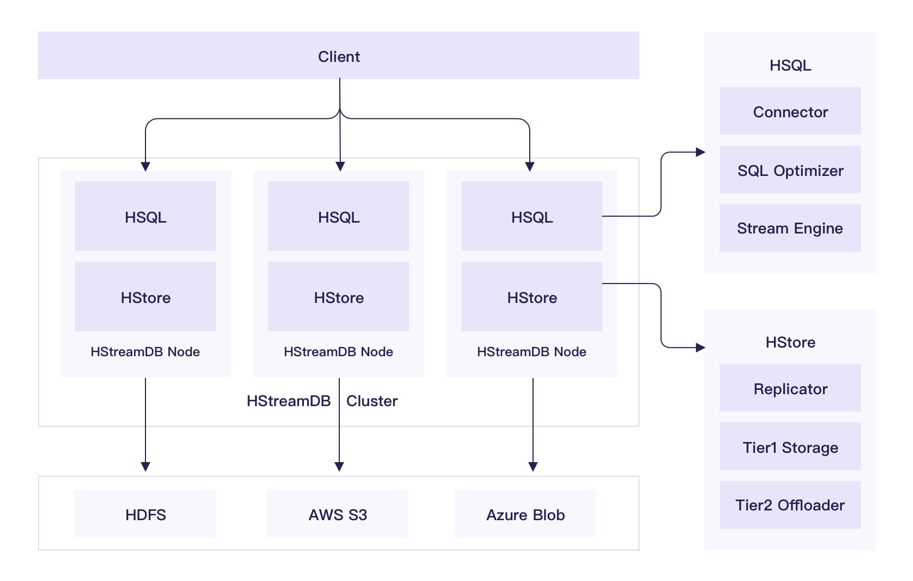
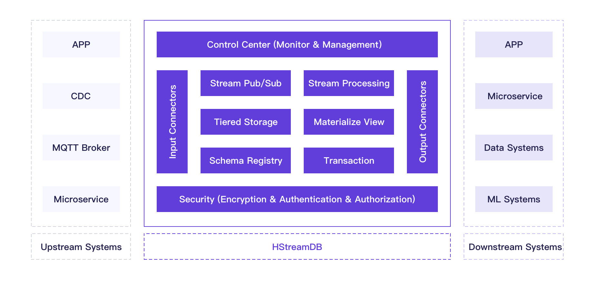

在之前的文章\[链接\]中，我们正式向大家提出了「流数据库」这一全新数据库品类。为了解决当前各行业实际业务中对于实时流数据存储和处理的种种需求，EMQ 一直在探寻一个适合 IoT 场景的流处理架构与方案。
—— HStreamDB 应运而生。我们相信，这就是流时代的答案。


HStreamDB 项目概述
==================

HStreamDB 是一款专为流式数据设计的，
针对大规模实时数据流的接入、存储、处理、分发等环节进行全生命周期管理的流数据库。
它使用标准 SQL (及其流式拓展）作为主要接口语言， 以实时性作为主要特征，
旨在简化数据流的运维管理以及实时应用的开发。

HStreamDB 的整体架构如下图所示， 单个 HStreamDB 节点主要由 HStream
Server (HServer) 和 HStream Storage (HStore) 两个核心部件组成， 一个
HStream 集群由若干个对等的 HStreamDB 节点组成，
客户端可连接至集群中任意一个 HStreamDB 节点， 并通过熟悉的 SQL
语言来完成各种从简单到复杂的流处理和分析任务。

<figure>
<figcaption>HStreamDB 整体架构<span label="fig:hstream-arch"></span></figcaption>
</figure>HStream Server (HServer) 作为 HStreamDB 的核心计算组件，
其本身被设计为无状态的， 它主要负责客户端的连接管理，安全认证， SQL
解析，SQL 优化， 以及流计算任务的创建、调度、执行和管理等。

具体的，HStream Server (HServer) 自顶向下可分为以下几层结构：

1.  接入层。主要负责客户端请求的协议处理、
    连接管理、以及安全认证和访问控制。

2.  SQL 层。客户端主要通过 SQL 与 HStreamDB 交互，
    来完成大部分流处理和实时分析的任务。 这一层主要负责将用户提交的 SQL
    语句编译成数据流图 传递给下一层继续处理。 与经典的数据库系统一样，
    这里包含两个核心的子组件：SQL 解析器 和 SQL 优化器。 SQL
    解析器负责负责完成词法分析、语法分析，将 SQL 语句
    编译到对应的关系代数表达式； SQL 优化器与关系数据库主流的 CBO
    优化器不同， 除了负责基本的关系代数优化、基于规划的优化外，
    还有就是要做基于 streaming context 的特殊优化， 比如 streaming
    fusion 之类的。

3.  Stream 层。 这一层包含各种常见的流处理算子的实现，
    以及表达数据流图的数据结构和 DSL，
    还支持用户自定义函数作为处理算子。 这一层主要负责为 SQL
    层传递下来的逻辑数据流图 选择对应的算子实现，生成可执行的数据流图。

4.  Runtime 层。 这一层负责实际执行数据流图的计算任务并返回结果。
    主要包含任务调度器、状态管理器以及执行优化器等组件。
    其中调度器负责计算任务在可用计算资源之间的调度，
    可能是在单个处理的多线程之间调度，
    也可能是在单机的多处理器之间调度，
    或者是在分布式集群的多台机器或容器之间调度。
    状态管理器负责协调流出里算子的状态维护和容错。
    执行优化器可以通过自动化并行等手段加速数据流图的执行。

HStream Storage (HStore) 作为 HStreamDB 的核心存储组件，
它是专门为流式数据设计的低延时存储组件，
不但能够分布式持久化存储大规模实时数据， 而且能够通过 Auto Tiring 机制，
无缝对接 S3 之类的大容量二级存储， 实现历史数据和实时数据的统一存储。

HStream Storage (HStore) 的核心存储模型是非常贴合流式数据的
日志模型，数据流本身可以看作是一个无限增长的日志，
它支持的典型操作包括追加写和区间读， 不支持任何更新和删除操作。

HStream Storage (HStore) 可分为以下几个层次：

1.  Streaming Data API 层。

    这一层提供核心的数据流管理和读写操作， 包括数据流的创建、删除，
    以及向数据流中写入数据和消费数据流中的数据。 在 HStore
    对创建的数据流的数量没有限制， 同时能支持大量数据流的并发写入，
    在大量数据流并发写入的时候依然能够保持稳定的低延迟， HStore
    的存储设计中并没有按照数据流来做存储，
    因此数据流的创建是非常轻量的操作。 针对数据流的特点， HStore 提供了
    append 操作支持数据快速写入， 同时在读取流数据方面，
    提供了基于订阅语义的 read 操作，
    数据流中新写入的数据会被迅速推送给消费者。

2.  复制层(replicator)。 这一层主要基于优化的 Paxos
    共识引擎实现了流数据的强一致复制， 保证数据的容错和可高可用性。

    通过非确定性放置的策略， 最大化集群数据的均衡和可用性。

    支持复制组在线变配， 在线水平扩展， 数据均衡， 自动伸缩。

    本层提供流数据存储的核心接口和实现，
    将连续的数据流统一抽象为基本的日志模型。 内部的基本存储单元称为
    segment, 该层通过在各个存储节点间通过自动均衡 segment
    来实现存储层的水平扩展。
    写入的每份数据会复制到多个存储节点来保证可靠性 和容错。
    该层还提供可选的数据索引支持， 可为保存的数据生成索引，
    典型的包括主键(业务 key)索引和时间戳索引。 该层还需要提供 compress
    和 compact 支持。

3.  一级存储层。 本地存储基于 RocksDB 存储引擎， 按时间片划分 column
    family 的方式， 只使用 L0 的 SST Files， 支持数据高速写入，

    最新写入的数据一般保存在磁盘上，
    或者通过存储节点内部的嵌入式数据库写入。 由于磁盘存储成本较高，
    不适合将大量数据直接保存在磁盘上，
    支持通过配置自动将冷数据转储到更便宜的云存储上。

4.  二级存储层。 该层为多种长期存储系统提供统一的接口， 支持诸如 HDFS,
    AWS S3 等， 实现实时数据和历史数据的统一访问。

HStreamDB 功能特性
==================

<figure>
<figcaption>HStreamDB 功能架构<span label="fig:hstream-features"></span></figcaption>
</figure>基于 SQL 的数据流处理
---------------------

HStreamDB 提供基于事件时间的完整的流处理能力,不仅支持基本的过滤、转
换操作,还支持按 key 做聚合计算,基于多种时间窗口的计算,以及数据流 之间
join 的能力,同时也支持乱序和晚到的消息的特殊处理,保证计算结
果的准确性。用户只需要通过 SQL 语句就能完成上述所有的处理功能,无
需学习任何三方 API。HStream 的流处理还提供了丰富的扩展能力,用户
可以针对自己的业务自行扩展。

数据流的物化查询
----------------

高效的增量计算引擎，timely flow， 支持快速的增量计算，
维护大规模物化视图的实时更新。

HStreamDB 提供了物化视图的功能,支持在持续更新的数据流上进行查询操 作。
HStream 内部会根据数据流的变化实时更新物化视图,用户可通过 SQL
语句查询物化视图获得实时的数据洞察。

数据流管理
----------

支持创建大量的数据流，
在大量数据流并发写入的情况下仍然能够保持稳定的低延迟。

\[TODO：修改\] 方案基于经典的 Pub/Sub
模型,提供互斥订阅,共享订阅等多种订阅
模型,能够灵活应对不同的业务需求。同时 HStream 集群能够支持百万量 级的
Topic,在大量 Topic 数据写入的情况下依然能保证稳定的消费时延。

数据流的持久化存储
------------------

方案提供低延时的可靠的数据流存储,保证写入的数据消息不丢失,并
且能够重复消费。HStream 会将写入的数据消息复制到多个存储节点,提
供高可用和容错能力。HStream 同时支持将冷数据转储到成本更低的存储
服务上,比如对象存储,分布式文件存储等,存储的容量可无限扩展,能够
实现数据的永久存储。

数据流的 Schema 管理
--------------------

HStreamDB 提供了内建的 Schema 管理功能,支持包括 Json, Avro, Protobuf 等
多种格式的 Schema 存储,同时也支持 Schema 的演化,管理多版本 Schema
之间的兼容性。通过 Schema 能够提升数据消息的质量,简化消费的流程,
避免很多不必要的数据错误。

数据流的接入和分发
------------------

HStreamDB 提供了和包括 MQTT Broker, MySQL,ElasticSearch, Redis 等多
种数据系统相连接的 Connector,方便用户和外部的数据系统进行集成。

安全机制
--------

HStreamDB 提供包括 TLS 加密传输,基于 OAuth, JWT 等的身份认证以及授
权机制,同时预留了安全插件的接口,用户可根据需要对默认的安全机制进
行扩展。

监控和运维工具
--------------

HStreamDB 提供了基于 Web 的控制台,包含大量的系统仪表盘和可视化图表,
能够对集群机器状态,系统关键指标等进行详细的监控,方便运维人员对集
群进行管理。

HStreamDB 应用场景
==================

实时数据分析
------------

传统的数据分析通常基于批处理技术，
批处理一般是在预先收集好的有限的数据集上运行，
因此分析的结果往往不包含最新的数据， 有较高的时延。 HStreamDB
能够对实时的数据流进行分析， 并随着数据流的变化及时地更新结果，
这能够更好的支持诸如网站用户活动实时预测、
物联网传感器数据实时分析等应用。 相比批处理，
不但能提供更实时的数据洞察，
而且避免了周期性调度批处理任务的易出错和复杂性。

事件驱动应用
------------

事件驱动应用通常是根据到来的事件实时触发对应的动作或行为，
它可以是无状态的或者带状态的， 比如： 金融交易中的实时欺诈检测，
业务流程监控预警， 物联网规则引擎等。 基于 HStreamDB，
实现这些复杂的事件驱动应用可能仅仅需要几条 SQL 语句，
大大降低了开发和维护这些应用的成本。

实时数据管道
------------

企业内部往往需要在多个数据系统之间进行数据同步和迁移，
比如将在线的事务数据库中的数据拷贝到离线的数据仓库进行分析，
这个过程通常是由一套 ETL 系统完成的， 这类 ETL
系统的开发和维护成本都比较高， 而且它的数据同步往往不是实时的，
扩展性也比较差。 HStreamDB 集成了多种外部系统的连接器，
能够非常方便地搭建实时的数据管道，
实现实时构建索引，实时构建缓存等数据同步任务。

在线机器学习
------------

如今机器学习系统在业务系统中起着越来越重要的作用，
包括搜索、推荐、风控等背后都广泛依赖机器学习系统。
然而随着在线业务及相关应用场景的井喷式发展，
常规的离线系统及离线机器学习平台已无法满足业务发展要求。 HStreamDB
的实时计算引擎能够助力机器学习系统的实时化，
实现在线特征提取，实时推荐等应用。

HStreamDB 快速上手
==================

下面我们将基于 docker 快速上手使用 HStreamDB。

拉取 docker 镜像
------------

```sh
docker pull hstreamdb/logdevice
docker pull hstreamdb/hstream
```

在 docker 中启动一个本地的 HStream Server
------------

#### 创建一个目录用于存储数据 

```sh
mkdir ./dbdata
```

####  启动 HStream Storage 
 
```sh
docker run -td --rm --name some-hstream-store -v dbdata:/data/store --network host hstreamdb/logdevice ld-dev-cluster --root /data/store --use-tcp
```

### 启动 HStreamDB Server

```sh
docker run -it --rm --name some-hstream-server -v dbdata:/data/store --network host hstreamdb/hstream hstream-server --port 6570 -l /data/store/logdevice.conf
```

启动 HStreamDB CLI
------------


```sh
docker run -it --rm --name some-hstream-cli -v dbdata:/data/store --network host hstreamdb/hstream hstream-client --port 6570
```

如果一切正常的话，进入 CLI 后你会看到类似下面的信息：

```
Start HStream-Cli!
Command
  :h                        help command
  :q                        quit cli
  show queries              list all queries
  terminate query <taskid>  terminate query by id
  terminate query all       terminate all queries
  <sql>                     run sql

>
```

创建数据流 
------------

下面我们将用 `CREATE STREAM` 语句创建一个新的数据流，

```sql
CREATE STREAM demo WITH (FORMAT = "JSON");
```

在 CLI 中执行上述语句后，你会看到类似下面的信息，表示执行成功。

```Haskell
Right
    ( CreateTopic
        { taskid = 0
        , tasksql = "CREATE STREAM demo WITH (FORMAT = "JSON");"
        , taskStream = "demo"
        , taskState = Finished
        , createTime = 2021 - 02 - 04 09 : 07 : 25.639197201 UTC
        }
    )
```

执行一个持续查询 
------------

我们使用 `SELECT` 语句来对数据流进行实时处理和分析。
在 CLI 中执行以下语句，

```sql
SELECT * FROM demo WHERE humidity > 70 EMIT CHANGES;
```

执行完成后会发现并没有产生任何结果，这是正常的，
因为现在数据流中还没有任何数据，
接下来我们将向数据流中写入一些数据并观察结果。
另外，请注意这个 `SELECT` 语句不同于普通数据库的`SELECT` 在一次执行完毕后返回，
相反它会一直执行下去，
除非你显式的终止它。

开启一个新的 CLI 会话
-----------------------------

```sh
docker exec -it some-hstream-cli hstream-client --port 6570
```

向数据流中插入数据
-----------------------------

执行以下 `INSERT` 语句向数据流中写入数据， 

```sql
INSERT INTO demo (temperature, humidity) VALUES (22, 80);
INSERT INTO demo (temperature, humidity) VALUES (15, 20);
INSERT INTO demo (temperature, humidity) VALUES (31, 76);
INSERT INTO demo (temperature, humidity) VALUES ( 5, 45);
INSERT INTO demo (temperature, humidity) VALUES (27, 82);
INSERT INTO demo (temperature, humidity) VALUES (28, 86);
```

如果一切运行正常的话， 你将会在刚才的 CLI 窗口看到以下实时的输出：
```
{"temperature":22,"humidity":80}
{"temperature":31,"humidity":76}
{"temperature":27,"humidity":82}
{"temperature":28,"humidity":86}
```

HStreamDB 开源社区和发展规划
============================

作为一家开源基础软件供应商，
EMQ 始终坚信开源的价值与力量，
因此 HStreamDB 从立项之初就完全采用开源的方式在 GitHub 上进行开发。

目前 HStreamDB 项目正在团队的努力下积极向前推进着，
同时这也正是各位开源社区的伙伴们一同参与进来的最好时机。
我们诚邀大家与我们共同建设 HStreamDB 的开源社区：
大家可以通过访问 HStreamDB 的网站[链接]，
或者 GitHub 地址来[链接]来了解项目相关信息，
也欢迎加入我们的 Slack Channel [链接] 参与讨论。我们还将定期举办 Open Day 活动，与大家分享项目进展，交流技术心得。
在后续的规划中，HStreamDB 将陆续支持和完善分布式处理支持、Schema 管理、SQL 优化以及监控和运维等功能。

相信在每一个热爱数据库、关注流处理的伙伴的支持下，我们将共同创造和见证流时代下数据库领域新的春天。
